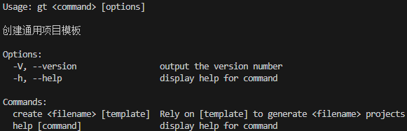

# Generation Template

## 安装

```js
  // 安装全局包
  npm install generation-template -g
```

### 使用

```js
  // 使用gt create 创建项目
  gt create <my-project> [template]
```
### [template]

```text
  template-element-ts | element-ts
```

### 示例

> `gt -h`


